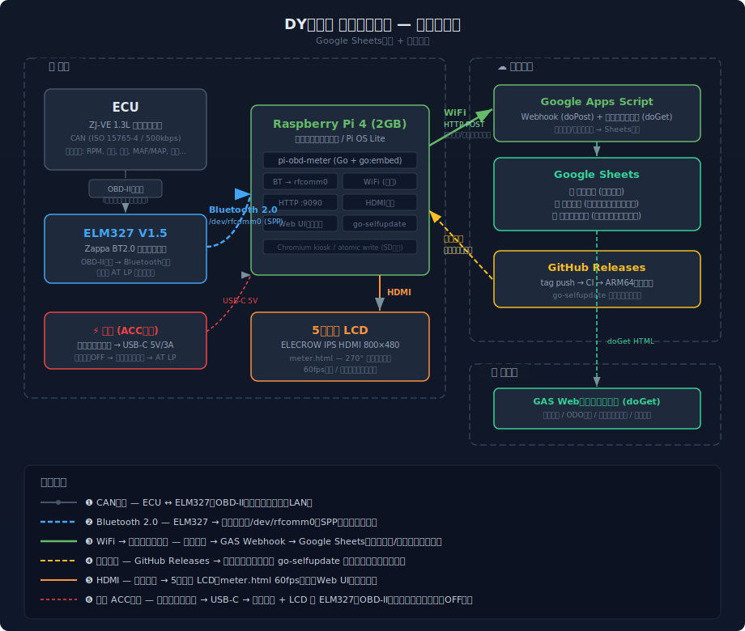
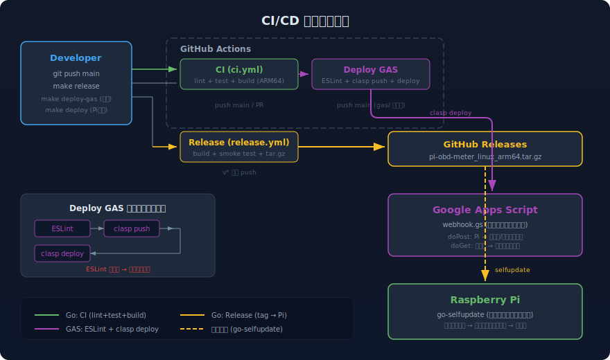

# pi-obd-meter

**OBD-2 車載メーター + 走行記録 + スマホダッシュボード**

Raspberry Pi + ELM327 で速度・RPM・スロットル・インマニ圧・瞬間燃費を5インチLCDにリアルタイム表示。
走行距離・メンテナンス状態を Google Sheets に自動記録し、スマホから給油記録・ODO補正・メンテナンス管理ができる。

## 対応車種

**OBD-2ポートがあり、ELM327で通信できる車ならほぼ全車対応。** 2000年代半ば以降の国産車であれば大抵動く（日本車のOBD-2義務化は2010年だが、それ以前から搭載している車も多い）。

### 必要なPID

| PID | 用途 | 必須 |
|-----|------|------|
| 0x0C | RPM | メーター表示 + 燃費推定 |
| 0x0D | 車速 | メーター表示 + 距離積算 |
| 0x04 | エンジン負荷 | 燃費推定 |
| 0x11 | スロットル開度 | メーター表示 |

オプションPID（あればより正確な燃費推定が可能）:

| PID | 用途 |
|-----|------|
| 0x10 | MAF (g/s) — MAFセンサー搭載車で最も正確な燃費推定 |
| 0x0B | インマニ圧 (MAP) — Speed-Density法による燃費推定 |
| 0x05 | 冷却水温 — 水温インジケーター |

`pi-obd-scanner` で事前に対応PIDを確認できる:

```bash
./pi-obd-scanner -port /dev/rfcomm0
```

### 対応できない車

- EV / HV の電動走行モード（エンジン回転なし）
- 1996年以前の旧車（OBD-2未搭載）

### 動作確認済み車種

| 車種 | 型式 | エンジン | OBDプロトコル | 検出PID数 |
|------|------|----------|---------------|-----------|
| マツダ DYデミオ | DBA-DY3W | ZJ-VE 1.3L | CAN 11bit 500kbaud (ATSP6) | 28 |

## 機能

### 車載メーター (5インチ LCD)
- 速度の270° SVGアークゲージ（速度帯で色が変化）
- スロットル開度アーク（内側、HSLグラデーションで青→赤）
- RPMアーク（外側、レッドゾーン背景付き）
- ゲージ左上にレンジ、右上にギア番号、HOLD/LOCKラベル
- 下部にTEMP・TRIP・ECOインジケーター（アイコン付き）
- 右パネルインジケーター: GEAR / ECO / TRIP / TEMP / MAP / MAF / O2 / TRIM
- 60fps LERP補間アニメーション、時刻ベース自動輝度調整
- 画面3秒長押しでキオスク終了

### 自動記録 (Google Sheets)
- **トリップ記録**: 走行距離・最高速度・平均速度・走行時間・アイドル時間・燃料消費量
- **メンテナンス状態**: 走行距離/日付ベースのリマインダー（エンジン始動時 + 5分間隔で送信）
- **燃費推定**: MAF > MAP (Speed-Density) > 負荷×RPM の優先順位で自動選択

### スマホダッシュボード (GAS Webアプリ)
- 給油記録（日付・距離・給油量 → 燃費自動算出）
- ODO補正（メーター実値との差分を補正）
- メンテナンス進捗確認・リセット
- ダークテーマ、ホーム画面追加対応

## アーキテクチャ


### データフロー

```
ECU → ELM327 (BT) → Raspberry Pi → meter.html (車載LCD: 速度/RPM/スロットル/MAP/燃費)
                                   → GAS Webhook → Google Sheets (トリップ/メンテ記録)
                                                 ↕
                               スマホブラウザ → GAS doGet (給油記録/ODO補正/メンテ管理)
```

### 通信構成



## ハードウェア

### パーツリスト

| # | パーツ | 選定品 | 目安価格 |
|---|--------|--------|---------|
| 1 | ELM327 | Zappa V1.5 BT2.0 スイッチ付き | ~1,550 |
| 2 | Raspberry Pi | Pi 4 Model B 2GB (技適あり) | ~7,000-9,200 |
| 3 | ケース | GeeekPi アルミケース (デュアルファン) | ~2,000 |
| 4 | ディスプレイ | ELECROW 5インチ IPS HDMI (800x480) | ~5,699 |
| 5 | microSD | SanDisk MAX ENDURANCE 32GB | ~1,200 |
| 6 | モニター固定 | スマホホルダー | ~300-1,000 |
| - | 電源 | シガーソケット USB-C (5V/3A) | - |

**合計: 約18,000-20,000円**

### 選定理由

- **ELM327 BT2.0**: Classic Bluetooth (SPP) で rfcomm 互換。BLEはGATT複雑で不採用
- **Pi 4 2GB**: ARM64, WiFi/BT内蔵。2GBで十分
- **アルミケース+デュアルファン**: ダッシュボード上は79-85°Cに達するため
- **MAX ENDURANCE**: 書込耐久15,000時間。ドラレコ用途想定のSDで車載に適合
- **ELECROW 5インチ IPS**: HDMI接続、IPSパネル(178°広視野角)、Pi USBから給電可

## セットアップ

詳細は [docs/setup-guide.md](docs/setup-guide.md) を参照。

### クイックスタート

```bash
# 1. 初回セットアップ（ディレクトリ作成 + systemd登録 + swap無効化）
./scripts/deploy.sh setup

# 2. Google Apps Script のセットアップ
#    GASエディタでwebhook.gsを貼り付けてデプロイ
#    → URLをconfigs/config.json の webhook_url に設定
#    ※ 以降の更新は make deploy-gas または git push で自動反映

# 3. デプロイ
make deploy
```

### ELM327 Bluetooth 接続の注意

- `hciconfig hci0 class 0x200000` と `hciconfig hci0 piscan` を先に実行（BR/EDRスキャン用）
- `hcitool scan` でClassic Bluetoothのスキャンを行う（`bluetoothctl scan on` はBLEのみの場合がある）
- OBDプロトコルは `configs/config.json` の `obd_protocol` で設定（DYデミオは `"6"` = CAN 11bit 500kbaud）

### ディスプレイ設定

ELECROW 5インチ用に `/boot/firmware/config.txt` へ追記:

```
hdmi_force_hotplug=1
max_usb_current=1
hdmi_drive=1
hdmi_group=2
hdmi_mode=87
hdmi_cvt 800 480 60 6 0 0 0
```

## 車両設定

`configs/config.json` で車両ごとのパラメータを設定する。全パラメータの詳細は [docs/configuration.md](docs/configuration.md) を参照。

```json
{
  "serial_port": "/dev/rfcomm0",
  "webhook_url": "https://script.google.com/macros/s/XXXXXX/exec",
  "engine_displacement_l": 1.3,
  "max_speed_kmh": 180,
  "initial_odometer_km": 98000,
  "fuel_rate_correction": 1.3,
  "throttle_idle_pct": 11.5,
  "fuel_tank_l": 40,
  "obd_protocol": "6",
  "maintenance_reminders": [
    { "id": "oil_change", "name": "エンジンオイル交換", "type": "distance", "interval_km": 3000, "warning_pct": 0.8 }
  ]
}
```

他車種への適用時に必要なチューニング項目（ハードコード値を含む）は [docs/calculation-logic.md](docs/calculation-logic.md) を参照。

## プロジェクト構成

```
pi-obd-meter/
├── cmd/
│   ├── pi-obd-meter/         # メインアプリ（車載）
│   │   ├── main.go           #   エントリポイント + graceful shutdown
│   │   ├── app.go            #   アプリケーションロジック + OBDループ
│   │   ├── api.go            #   ローカルHTTP API (/api/realtime 等)
│   │   ├── config.go         #   設定読み込み + バリデーション
│   │   ├── fuel.go           #   燃費計算 (MAF / MAP / 負荷×RPM)
│   │   ├── filter.go         #   OBDスパイク除去フィルター
│   │   └── update.go         #   自動更新 (go-selfupdate)
│   └── pi-obd-scanner/       # PIDスキャナー（診断用）
├── internal/
│   ├── obd/                  # ELM327通信、PID定義、DTC
│   ├── trip/                 # トリップ追跡（車速積分、燃料積算、状態永続化）
│   ├── sender/               # GAS Webhook送信（リトライキュー）
│   ├── display/              # 画面輝度制御（時刻ベース、xrandr）
│   ├── maintenance/          # メンテナンスリマインダー（距離/日付ベース）
│   └── atomicfile/           # アトミックファイル書き込み（tmp+rename+fsync）
├── web/
│   ├── embed.go              # go:embed でstatic/をバイナリに埋め込み
│   └── static/
│       ├── meter.html        # メーター画面HTML
│       ├── meter.css         # CSS (Custom Properties でテーマ管理)
│       ├── js/
│       │   ├── main.js       # エントリポイント + APIポーリング
│       │   ├── gauge.js      # 速度ゲージ(針+アーク) + RPMアーク + スロットルアーク + ギア/レンジ + 下部インジケーター
│       │   └── indicators.js # 右パネルインジケーター (RPM/ECO/TRIP等)
│       └── fonts/            # Orbitron (速度表示), ShareTechMono (リードアウト)
├── gas/
│   ├── webhook.gs            # Google Apps Script（記録 + Webダッシュボード）
│   ├── .clasp.json           # clasp プロジェクト設定
│   └── appsscript.json       # GAS マニフェスト
├── configs/
│   ├── config.json           # アプリ設定（シリアル、webhook、車両パラメータ等）
│   ├── pi-obd-meter.service  # systemd メインサービス
│   ├── kiosk.service         # systemd キオスクモード
│   ├── kiosk.sh              # Chromium キオスク起動スクリプト
│   ├── auto-update.service   # systemd 自動更新 (oneshot)
│   └── auto-update.timer     # systemd 自動更新タイマー (2分間隔)
├── scripts/
│   ├── deploy.sh             # 開発・デプロイスクリプト
│   └── auto-update.sh        # Pi 自動更新スクリプト
├── docs/                     # ドキュメント
│   ├── setup-guide.md        # セットアップガイド
│   ├── development.md        # 開発・CI/CD・リリース
│   ├── configuration.md      # 設定パラメータ詳細
│   ├── calculation-logic.md  # 算出ロジック・閾値一覧
│   └── wifi-troubleshooting.md # Wi-Fi トラブルシューティング
├── .github/workflows/
│   ├── ci.yml                # CI (lint + test + build)
│   ├── deploy-dev.yml        # develop デプロイ (CI成功時)
│   ├── deploy-gas.yml        # GAS 自動デプロイ
│   ├── release.yml           # リリースビルド (タグ push)
│   └── claude-review.yml     # Claude Code Review (PR自動レビュー)
├── CLAUDE.md                 # AI開発支援用プロジェクト説明
└── go.mod
```

## 開発

詳細は [docs/development.md](docs/development.md) を参照。

### Make ターゲット

```bash
# 開発
make deploy          # ビルド + rsync転送 + サービス再起動
make logs            # リアルタイムログ表示
make ssh             # ラズパイにSSH接続
make status          # サービス状態確認
make restart         # サービス再起動（転送なし）

# テスト
make test            # テスト実行
make lint            # golangci-lint
make check           # lint + test

# ビルド
make build           # ローカルビルド
make build-arm64     # ARM64 クロスコンパイル

# GAS デプロイ
make deploy-gas      # gas/webhook.gs を GAS に push

# リリース (PRベース: develop → main → タグ push)
make release         # パッチ自動インクリメント (v0.3.1 → v0.3.2)
make release V=v1.0.0  # バージョン明示指定
```

### CI/CD



| ワークフロー | トリガー | 内容 |
|---|---|---|
| **CI** | push / PR (main, develop) | lint + test + build (host + ARM64) |
| **Deploy Dev** | CI成功 (develop) | ARM64ビルド → `dev-latest` pre-release |
| **Release** | タグ `v*` push | ARM64ビルド → GitHub Release |
| **Deploy GAS** | push (main, develop) + `gas/` 変更 | ESLint → clasp push → clasp deploy |
| **Claude Review** | PR open / `@claude` メンション | AIコードレビュー + 自動修正 |

**main ブランチは保護されており**、CI (`test` ジョブ) の通過が必須。直接 push は不可（admin は緊急時のみ可）。

### Pi 自動更新

`auto-update.timer` (systemd) が2分間隔で GitHub Releases をポーリング。
新ビルド検出時にダウンロード → バイナリ差し替え → サービス再起動を自動実行。

1. Stable release (`latest`) を優先チェック
2. なければ dev build (`dev-latest` pre-release) をチェック

## ドキュメント

| ドキュメント | 内容 |
|---|---|
| [docs/setup-guide.md](docs/setup-guide.md) | Raspberry Pi 初期セットアップ、BT接続、ディスプレイ、GAS設定 |
| [docs/development.md](docs/development.md) | ブランチ戦略、CI/CD、リリースフロー、デプロイ |
| [docs/configuration.md](docs/configuration.md) | config.json 全パラメータ、車種チューニング |
| [docs/calculation-logic.md](docs/calculation-logic.md) | 燃費推定・インジケーター・閾値の算出ロジック |
| [docs/wifi-troubleshooting.md](docs/wifi-troubleshooting.md) | Wi-Fi 接続問題の診断・復旧手順 |

## ライセンス

MIT
