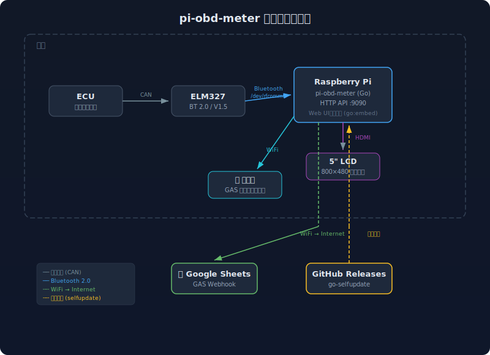

# 🚗 pi-obd-meter

**OBD-2 燃費メーター**

Raspberry Pi + ELM327 で車両データをリアルタイム表示し、トリップデータを Google Sheets に自動記録する。
OBD-2対応車であれば車種を問わず利用可能。

## 対応車種

**OBD-2ポートがあり、ELM327で通信できる車ならほぼ全車対応。** 2000年代半ば以降の国産車であれば大抵動く（日本車のOBD-2義務化は2010年だが、それ以前から搭載している車も多い）。

### 燃費計算方式

車種によって搭載センサーが異なるため、2つの計算方式を用意している。

| 方式 | 必要センサー | 精度 | 対象車種 |
|------|------------|------|---------|
| **MAF方式** | MAFセンサー (PID 0x10) | ★★★ | トヨタ、日産、ホンダなど多数 |
| **MAP方式** | MAPセンサー (PID 0x0B) + 吸気温度 (PID 0x0F) | ★★☆ | マツダ Zファミリー等 |

- **MAF方式**: エアクリーナー後方のセンサーが吸入空気量を直接測定する。精度が高く、校正不要
- **MAP方式**: インテークマニホールドの圧力と吸気温度から空気量を推定する。体積効率(VE)の校正が必要（満タン法で調整）

自分の車がどちらかは `pi-obd-scanner` で確認できる。詳しくは「車両設定」セクションを参照。

### 対応できない車

- EV / HV の電動走行モード（エンジン回転なし）
- 1996年以前の旧車（OBD-2未搭載）
- 一部の軽自動車（返すPIDが少ないことがある）

### 動作確認済み車種

- マツダ DYデミオ (DBA-DY3W / ZJ-VE 1.3L)

## アーキテクチャ



詳細な通信構成図は [docs/communication-diagram-v2.svg](docs/communication-diagram-v2.svg) を参照。

## ハードウェア

### パーツリスト

| # | パーツ | 選定品 | 参考URL | 目安価格 |
|---|--------|--------|---------|---------|
| ✅ | ELM327 | Zappa V1.5 BT2.0 スイッチ付き | — (購入済み) | ¥1,550 |
| ❶ | Raspberry Pi | Pi 4 Model B 2GB (技適あり) | [Amazon](https://www.amazon.co.jp/dp/B07TD42S27) | ¥7,000〜9,200 |
| ❷ | ケース | GeeekPi アルミケース (デュアルファン) | [Amazon](https://www.amazon.co.jp/dp/B084JP98ZM) | ¥2,000 |
| ❸ | ディスプレイ | ELECROW 5インチ IPS HDMI (800×480) | [Amazon](https://www.amazon.co.jp/dp/B0834RV8L1) | ¥5,699 |
| ❹ | microSD | SanDisk MAX ENDURANCE 32GB | [Amazon](https://www.amazon.co.jp/dp/B084CJLNM4) | ¥1,200 |
| ❺ | モニター固定 | スマホホルダー（エアコン吹き出し口等） | 100均 or Amazon | ¥300〜1,000 |
| — | 電源 | シガーソケット USB-C (5V/3A) | 手持ちを使用 | — |

**合計: 約¥18,000〜20,000**

### 選定理由

- **ELM327 BT2.0**: Classic Bluetooth (SPP) で rfcomm 互換。BLEはGATTが複雑で不採用。スイッチ付きで長期駐車時にOFFにできる
- **Pi 4 2GB**: ARM64, WiFi/BT内蔵。2GBで十分（メーター表示+OBD通信+HTTP送信）
- **アルミケース+デュアルファン**: JAFデータでダッシュボード上は79-85°Cに達するため、パッシブ冷却だけでは不足
- **MAX ENDURANCE**: 書込耐久15,000時間。ドラレコ用途想定のSDで車載に適合
- **ELECROW 5インチ IPS**: 800×480、HDMI接続、IPSパネル(178°広視野角)、Pi USBから給電可(5V/1A)、ドライバ不要。レビュー1,200件超の実績あり。スマホホルダーでダッシュボードに固定

## セットアップ

詳細は [docs/deploy-guide.md](docs/deploy-guide.md) を参照。

### ディスプレイ設定

ELECROW 5インチ用に `/boot/firmware/config.txt` へ追記:

```
hdmi_force_hotplug=1
max_usb_current=1
hdmi_drive=1
hdmi_group=2
hdmi_mode=87
hdmi_cvt 800 480 60 6 0 0 0
```

- `max_usb_current=1` はPi USBからモニター給電するために必要
- タッチ機能は車載では不使用のため、dtoverlay設定は不要

### ビルド & デプロイ

```bash
# 初回セットアップ
./scripts/deploy.sh setup

# 普段のデプロイ
./scripts/deploy.sh deploy

# Web UIだけ更新
./scripts/deploy.sh deploy-web
```

## 車両設定

`configs/config.json` で車両ごとのパラメータを設定する。

```json
{
  "engine_displacement_cc": 1348,
  "fuel_method": "map",
  "ve_coefficient": 0.85,
  "redline_rpm": 6500
}
```

| パラメータ | 説明 | 例 |
|-----------|------|-----|
| `engine_displacement_cc` | 排気量 (cc) | ZJ-VE: 1348, ZY-VE: 1498 |
| `fuel_method` | `"maf"` or `"map"` | PIDスキャン結果で決定 |
| `ve_coefficient` | 体積効率 (MAP方式時のみ。MAF方式では無視される) | 0.80〜0.90。満タン法で校正 |
| `redline_rpm` | レッドゾーン開始回転数 | 車種の仕様書を参照 |

### fuel_method の決め方

`pi-obd-scanner` でPIDスキャンして判断する。

```bash
./pi-obd-scanner -port /dev/rfcomm0
```

- `PID 0x10 (MAF)` が出た → `"maf"` を設定。吸入空気量を直接測定するため精度が高く、`ve_coefficient` の校正も不要
- `PID 0x0B (MAP)` が出た → `"map"` を設定。圧力と温度から空気量を推定するため、`ve_coefficient` の校正が必要
- 両方出た → `"maf"` を推奨（精度が高い）

### VE校正方法（MAP方式の場合）

1. 満タン給油
2. 普段どおり走る
3. 再度満タン給油。給油量と走行距離から実燃費を計算
4. メーターの表示燃費と比較
   - メーター > 実燃費 → VEを上げる
   - メーター < 実燃費 → VEを下げる
5. 繰り返して誤差5%以内を目指す

## プロジェクト構成

```
pi-obd-meter/
├── cmd/
│   ├── pi-obd-meter/        # メインアプリ（車載）
│   └── pi-obd-scanner/      # PIDスキャナー（診断用）
├── internal/
│   ├── obd/               # ELM327通信、PID定義、DTC
│   ├── trip/              # トリップ追跡
│   ├── sender/            # Google Sheets送信（GAS webhook）
│   ├── notify/            # Discord通知
│   ├── display/           # 画面輝度制御
│   └── maintenance/       # メンテナンスリマインダー
├── web/static/
│   ├── meter.html         # メーター画面（5インチLCD, 60fps）
│   └── control.html       # 操作画面（スマホ）
├── gas/
│   └── webhook.gs         # Google Apps Script
├── configs/
│   ├── config.json
│   └── pi-obd-meter.service
├── docs/
│   ├── deploy-guide.md
│   └── communication-diagram-v2.svg
├── scripts/
│   └── deploy.sh         # 開発・デプロイスクリプト
├── CLAUDE.md
└── go.mod
```

## ビルド & デプロイ

### ローカルビルド

```bash
# ホスト (Mac) 用ビルド
go build -o bin/pi-obd-meter ./cmd/pi-obd-meter
go build -o bin/pi-obd-scanner ./cmd/pi-obd-scanner

# Raspberry Pi (ARM64) 用クロスコンパイル
GOOS=linux GOARCH=arm64 go build -o bin/pi-obd-meter ./cmd/pi-obd-meter
GOOS=linux GOARCH=arm64 go build -o bin/pi-obd-scanner ./cmd/pi-obd-scanner
```

### deploy.sh コマンド一覧

すべての開発・デプロイ操作は `scripts/deploy.sh` で行う。

```bash
./scripts/deploy.sh <command>
```

| コマンド | 用途 |
|---------|------|
| `build` | クロスコンパイル (ARM64) |
| `deploy` | ビルド + rsync転送 + サービス再起動 |
| `deploy-web` | Web UIのみ転送 |
| `setup` | 初回セットアップ（ディレクトリ作成 + systemd登録） |
| `ssh` | ラズパイにSSH接続 |
| `logs` | リアルタイムログ表示 |
| `status` | サービス状態確認 |
| `restart` | サービス再起動（転送なし） |
| `overlay-on` | overlayFS有効化（SD保護モード） |
| `overlay-off` | overlayFS無効化（デプロイモード） |
| `release-install [version]` | GitHub Releasesからインストール（ラズパイ上で実行） |

SSH先を変更する場合は環境変数 `PI_HOST` を設定する（デフォルト: `pi@raspberrypi.local`）。

### デプロイの仕組み

Mac でクロスコンパイル（`GOOS=linux GOARCH=arm64`）して、rsync で差分転送する。ラズパイに Go のツールチェインは不要。

```
Mac: go build → bin/pi-obd-meter (ARM64バイナリ)
       ↓ rsync（差分のみ転送）
Pi:  /opt/pi-obd-meter/ → systemctl restart
```

overlayFS によるSD保護の詳細は [docs/deploy-guide.md](docs/deploy-guide.md) を参照。
